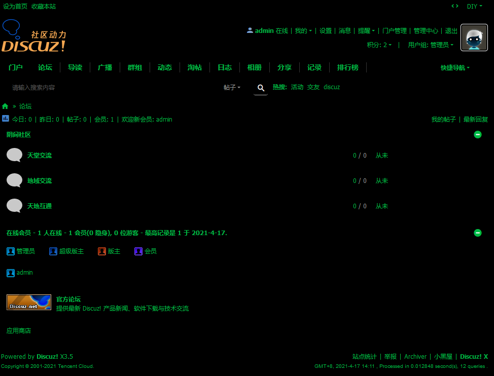
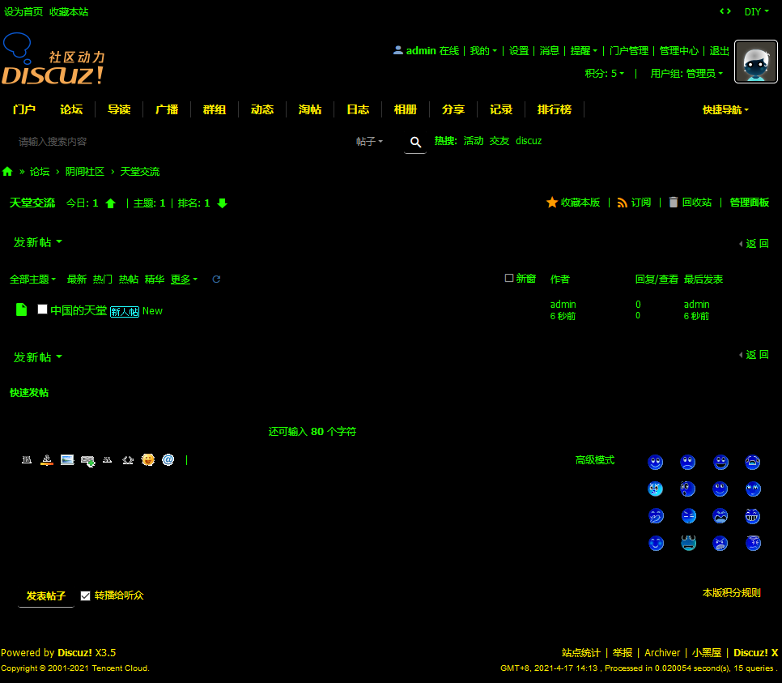
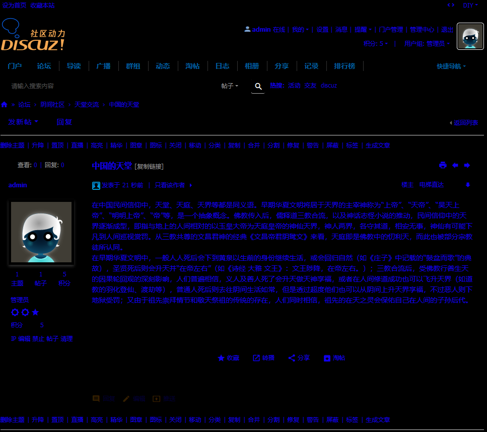
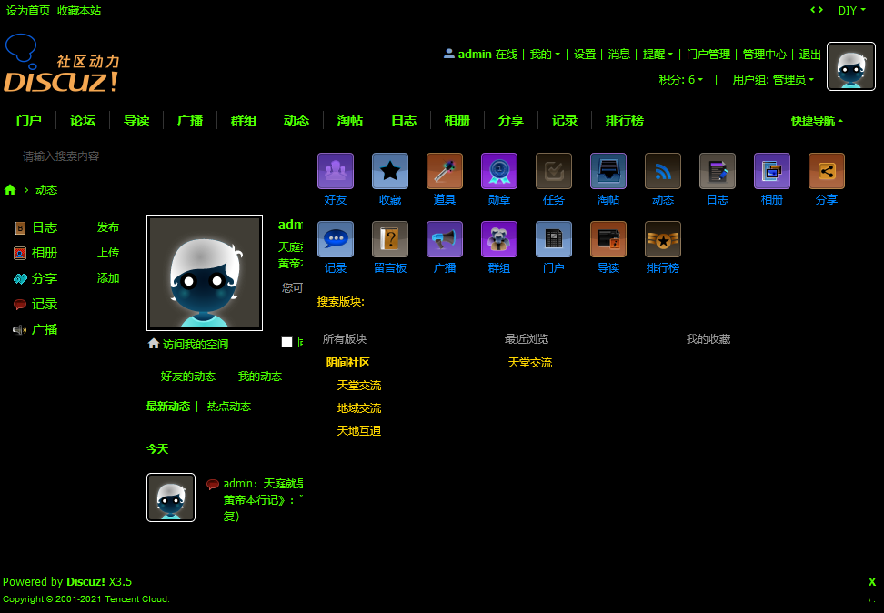
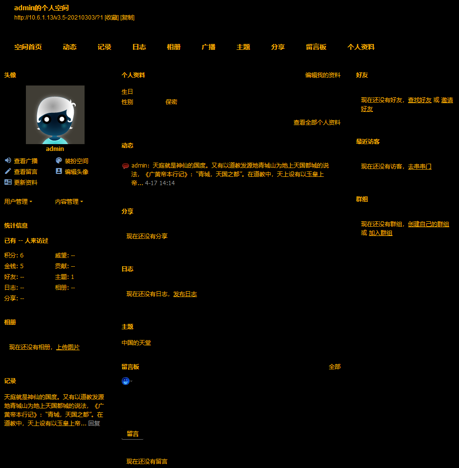

# 老周部落 暗黑滑稽风格

## 风格介绍

您还在纠结愚人节没有合适的论坛主题么？还在担心用户太多交流氛围下降么？还在纠结论坛暗黑风格还不够阴间么？

本风格特别为此设计，可以体现出暗黑滑稽风格的实质，用基于 CSS3 制作的绚烂效果打动用户内心，引导用户领会到暗黑滑稽风格的精髓。

## 版本支持

本风格仅支持 Discuz! X3.5 版本，具体可到 [https://gitee.com/Discuz/DiscuzX/tree/v3.5/](https://gitee.com/Discuz/DiscuzX/tree/v3.5/) 了解。

## 开源信息

本插件使用 Apache 2.0 License 发布，并已经登录 GitHub 平台，地址为: [https://github.com/laozhoubuluo/discuz_spoof](https://github.com/laozhoubuluo/discuz_spoof) 。

如有任何问题，欢迎您通过 Issue 反馈，或通过 Pull Requests 进行改进。

也欢迎您通过 Star 鼓励我们继续开发类似产品。
## 图片展示

